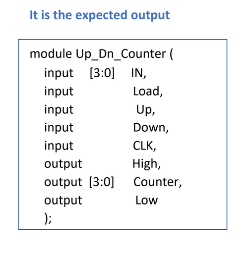
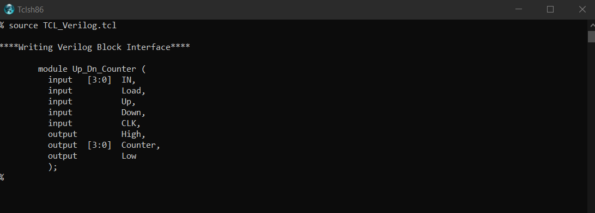

# Writing Verilog Block Interface using TCL scripting language

### Introduction 

The target of this Assignment to write the Verilog block interface based on the information in the above variables.

### The expected output 

---

### The results

---

